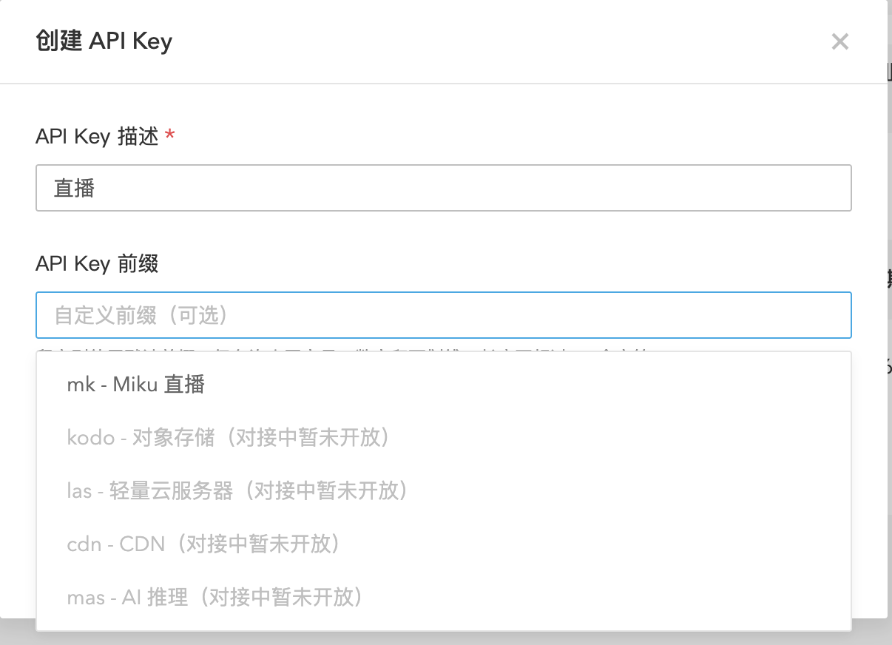

# Bearer Token Service V2 - 业务接入手册

> **面向业务接入方**: 本手册介绍如何在业务系统中验证用户的 Bearer Token,实现统一的鉴权能力。

## 📚 目录

- [核心功能:验证Token](#核心功能验证token)
- [记录用户与Token映射关系](#重要记录用户与token映射关系)
- [API接口参考](#api接口参考)
- [系统概述](#系统概述)
- [Token创建与管理](#token创建与管理)
- [错误码参考](#错误码参考)

---

## 核心功能:验证Token

### 业务系统如何验证Token?

**这是业务接入方最重要的功能**:在用户请求业务API时,验证用户携带的 Bearer Token 是否有效。

### 验证Token接口

```bash
POST http://bearer.qiniu.io/api/v2/validate
```

**请求头**:
```
Authorization: Bearer sk-a1b2c3d4e5f6...
```

**响应(验证成功)**:
```json
{
  "valid": true,
  "message": "Token is valid",
  "token_info": {
    "token_id": "tk_9z8y7x6w5v4u",
    "uid": "1234567",
    "is_active": true,
    "expires_at": "2026-03-30T10:00:00Z"
  }
}
```

**响应(验证失败)**:
```json
{
  "valid": false,
  "message": "Token has expired"
}
```

### 业务API集成示例

#### Python 示例

```python
import requests
from flask import Flask, request, jsonify

app = Flask(__name__)

def verify_token(bearer_token):
    """验证 Bearer Token"""
    validate_url = "http://bearer.qiniu.io/api/v2/validate"

    headers = {"Authorization": f"Bearer {bearer_token}"}

    response = requests.post(validate_url, headers=headers)

    if response.status_code == 200:
        result = response.json()
        if result.get("valid"):
            return result["token_info"]  # 返回token信息,包含uid

    return None

@app.route("/api/upload", methods=["POST"])
def upload_file():
    # 从请求头获取 Bearer Token
    auth_header = request.headers.get("Authorization", "")
    token = auth_header.replace("Bearer ", "")

    # 验证 Token
    token_info = verify_token(token)
    if not token_info:
        return jsonify({"error": "Unauthorized"}), 401

    # 获取用户UID(可用于查询业务系统中的用户信息)
    uid = token_info["uid"]

    # 执行业务逻辑
    # ... 处理文件上传 ...

    return jsonify({"success": True, "uid": uid})

if __name__ == "__main__":
    app.run()
```

#### Go 示例

```go
package main

import (
    "bytes"
    "encoding/json"
    "net/http"
)

type TokenInfo struct {
    TokenID   string   `json:"token_id"`
    UID       string   `json:"uid"`
    IsActive  bool     `json:"is_active"`
    ExpiresAt string   `json:"expires_at"`
}

type ValidateResponse struct {
    Valid     bool      `json:"valid"`
    Message   string    `json:"message"`
    TokenInfo TokenInfo `json:"token_info"`
}

func verifyToken(bearerToken string) (*TokenInfo, error) {
    url := "http://bearer.qiniu.io/api/v2/validate"

    req, _ := http.NewRequest("POST", url, nil)
    req.Header.Set("Authorization", "Bearer "+bearerToken)
    req.Header.Set("Content-Type", "application/json")

    client := &http.Client{}
    resp, err := client.Do(req)
    if err != nil {
        return nil, err
    }
    defer resp.Body.Close()

    var result ValidateResponse
    json.NewDecoder(resp.Body).Decode(&result)

    if result.Valid {
        return &result.TokenInfo, nil
    }

    return nil, nil
}

func uploadHandler(w http.ResponseWriter, r *http.Request) {
    // 从请求头获取 Bearer Token
    bearerToken := r.Header.Get("Authorization")
    if bearerToken == "" {
        http.Error(w, "Unauthorized", http.StatusUnauthorized)
        return
    }

    bearerToken = bearerToken[7:] // 去掉 "Bearer " 前缀

    // 验证 Token
    tokenInfo, err := verifyToken(bearerToken)
    if err != nil || tokenInfo == nil {
        http.Error(w, "Unauthorized", http.StatusUnauthorized)
        return
    }

    // 获取用户UID(可用于查询业务系统中的用户信息)
    uid := tokenInfo.UID

    // 执行业务逻辑
    // ... 处理文件上传 ...

    w.WriteHeader(http.StatusOK)
    json.NewEncoder(w).Encode(map[string]interface{}{
        "success": true,
        "uid":     uid,
    })
}
```

#### Node.js 示例

```javascript
const axios = require('axios');
const express = require('express');

const app = express();
app.use(express.json());

async function verifyToken(bearerToken) {
    const url = 'http://bearer.qiniu.io/api/v2/validate';
    const headers = { 'Authorization': `Bearer ${bearerToken}` };

    try {
        const response = await axios.post(url, {}, { headers });
        if (response.data.valid) {
            return response.data.token_info;
        }
    } catch (error) {
        console.error('Token validation failed:', error.message);
    }

    return null;
}

app.post('/api/upload', async (req, res) => {
    // 从请求头获取 Bearer Token
    const authHeader = req.headers.authorization || '';
    const token = authHeader.replace('Bearer ', '');

    // 验证 Token
    const tokenInfo = await verifyToken(token);
    if (!tokenInfo) {
        return res.status(401).json({ error: 'Unauthorized' });
    }

    // 获取用户UID(可用于查询业务系统中的用户信息)
    const uid = tokenInfo.uid;

    // 执行业务逻辑
    // ... 处理文件上传 ...

    res.json({ success: true, uid });
});

app.listen(3000);
```

### 关键要点

1. **在每个业务API请求中调用验证接口**
2. **检查返回的 `valid` 字段判断Token是否有效**
3. **使用返回的 `uid` 查询业务系统中的用户信息**

---

## 记录用户与Token映射关系

### ⚠️ 为什么必须记录

**Bearer Token Service 不存储用户业务信息**（如用户名、邮箱、手机号等），仅管理 Token 的生命周期。

**因此业务系统必须在自己的数据库中记录用户信息与 Token 的映射关系！**

**具体原因**：
1. **Token验证接口只返回 `uid`**，不返回用户业务信息
2. **便于后续按用户身份记录、统计、审计资源用量等**

### 建议的数据库表结构

```sql
CREATE TABLE user_tokens (
    id BIGINT PRIMARY KEY AUTO_INCREMENT,

    -- 业务系统用户ID（关联到你的 users 表）
    user_id BIGINT NOT NULL,

    -- 业务用户信息（冗余存储，方便查询）
    username VARCHAR(255),
    email VARCHAR(255),

    -- ⚠️ 重要：七牛UID（验证Token接口返回的uid字段）
    -- 用于关联七牛云账号体系和业务系统用户
    qiniu_uid VARCHAR(255) NOT NULL,

    -- Token信息
    token_id VARCHAR(255) NOT NULL,
    token_hash VARCHAR(255),               -- Token哈希(可选,建议存储)
    description VARCHAR(500),              -- Token用途描述
    created_at DATETIME DEFAULT NOW(),     -- 创建时间
    expires_at DATETIME,                   -- 过期时间

    INDEX idx_user_id (user_id),
    INDEX idx_qiniu_uid (qiniu_uid),       -- ⚠️ 重要：根据验证返回的uid查询
    INDEX idx_token_id (token_id),
    UNIQUE KEY uk_token_id (token_id)
);
```

**字段说明**:

| 字段 | 说明 | 来源 |
|------|------|------|
| `user_id` | 业务系统的用户ID | 你的业务系统 `users` 表主键 |
| `qiniu_uid` | 七牛云用户ID | **验证Token接口返回的 `uid` 字段** ⚠️ |
| `username`, `email` | 业务用户信息 | 你的业务系统用户数据 |


---

## API接口参考

> **说明**: 以下是业务接入方可能需要的查询类接口，用于获取Token信息、统计数据和审计日志。Token的创建、删除、状态更新等操作由用户在管理网站完成。

### 认证方式: QiniuStub

调用以下API需要使用 QiniuStub 认证方式。

**请求头格式**:
```
Authorization: QiniuStub uid={用户ID}&ut={用户类型}
```

**示例**:
```bash
Authorization: QiniuStub uid=1369077332&ut=1
```

**参数说明**:
- `uid`: 七牛用户 ID
- `ut`: 用户类型(通常为 1)

### 1. 列出 Tokens

获取当前用户的所有Token列表。

```bash
GET /api/v2/tokens?active_only=true&limit=50&offset=0
```

**请求头**:
```
Authorization: QiniuStub uid=1369077332&ut=1
```

**查询参数**:

| 参数 | 类型 | 默认值 | 说明 |
|------|------|--------|------|
| active_only | boolean | false | 仅显示激活的 Token |
| limit | integer | 50 | 返回数量(最大 100) |
| offset | integer | 0 | 偏移量 |

**响应示例**:
```json
{
  "account_id": "acc_1a2b3c4d5e6f",
  "tokens": [
    {
      "token_id": "tk_9z8y7x6w5v4u",
      "token_preview": "sk-a1b2c3d4e5f6g7******************************c9d0e1f2",
      "description": "Production API Token",
      "created_at": "2025-12-30T10:00:00Z",
      "expires_at": "2026-03-30T10:00:00Z",
      "is_active": true,
      "status": "normal",
      "total_requests": 12567,
      "last_used_at": "2025-12-30T09:45:00Z"
    }
  ],
  "total": 1
}
```

**Status 字段说明**:
- `normal`: 正常(未过期且已激活)
- `expired`: 已过期
- `disabled`: 已停用

### 2. 获取 Token 详情

获取指定Token的详细信息。

```bash
GET /api/v2/tokens/{token_id}
```

**请求头**:
```
Authorization: QiniuStub uid=1369077332&ut=1
```

**响应示例**:
```json
{
  "token_id": "tk_9z8y7x6w5v4u",
  "token_preview": "sk-a1b2c3d4e5f6g7******************************c9d0e1f2",
  "account_id": "acc_1a2b3c4d5e6f",
  "description": "Production API Token",
  "created_at": "2025-12-30T10:00:00Z",
  "expires_at": "2026-03-30T10:00:00Z",
  "is_active": true,
  "status": "normal",
  "total_requests": 12567,
  "last_used_at": "2025-12-30T09:45:00Z"
}
```

### 3. 获取 Token 使用统计

获取Token的使用统计信息。

```bash
GET /api/v2/tokens/{token_id}/stats
```

**请求头**:
```
Authorization: QiniuStub uid=1369077332&ut=1
```

**响应示例**:
```json
{
  "token_id": "tk_9z8y7x6w5v4u",
  "total_requests": 12567,
  "last_used_at": "2025-12-30T09:45:00Z",
  "created_at": "2025-12-30T10:00:00Z"
}
```

---

## 系统概述

### 什么是 Bearer Token Service?

Bearer Token Service 是**七牛云统一的 Bearer Token 鉴权服务**,在七牛内网环境运行,为所有内部业务系统提供统一的 Token 管理和验证能力。

**系统定位**:
- 🏢 **内网服务**: 部署在七牛内网,仅供内部业务系统访问
- 🔐 **统一鉴权**: 作为七牛云的统一 Bearer Token 鉴权中心
- 🌐 **服务地址**: `http://bearer.qiniu.io`(仅内网可访问)

**核心能力**:
- **Bearer Token 管理**: 创建、管理、验证 API Token
- **安全性保障**: Token 过期管理、状态控制

### 适用场景

- API 服务的访问认证
- 微服务之间的鉴权
- 第三方应用接入
- 移动端/前端应用认证
- 自动化脚本/CI/CD 工具认证

---

## Token创建与管理

**Token的创建、删除、状态更新等操作由用户在七牛管理网站完成**，不是业务接入方的职责。

### 用户Token管理流程

1. 用户通过七牛官网注册登录
2. 在密钥管理页面为各业务线创建和管理 Token
3. 可以执行以下操作:
   - 创建新的Token（指定过期时间等）
   - 查看Token列表
   - 禁用/启用Token
   - 删除Token



### 用户身份信息

- **UID**: 七牛用户 ID（如 `1369077332`）
- **UT**: 用户类型（通常为 `1`）

### 管理网站使用的认证方式: QiniuStub

七牛内部管理服务使用 QiniuStub 认证方式进行身份验证。

**请求头格式**:
```
Authorization: QiniuStub uid={用户ID}&ut={用户类型}
```

**示例**:
```bash
Authorization: QiniuStub uid=1369077332&ut=1
```

> **注意**: 业务接入方无需关心Token的创建和管理接口，只需要调用验证接口即可。

---

## 错误码参考

### HTTP 状态码

| 状态码 | 说明 | 处理方式 |
|--------|------|----------|
| 200 | 成功 | - |
| 201 | 创建成功 | - |
| 400 | 请求参数错误 | 检查请求体格式和参数 |
| 401 | 认证失败 | 检查 QiniuStub 认证参数或 Bearer Token |
| 404 | 资源不存在 | 检查 Token ID 或资源 ID |
| 500 | 服务器内部错误 | 联系管理员 |
| 503 | 服务不可用 | 稍后重试 |

### 业务错误码

**认证相关(4001-4099)**:

| 错误码 | 消息 | 说明 |
|--------|------|------|
| 4004 | Invalid bearer token | Bearer Token 无效 |
| 4005 | Token has expired | Token 已过期 |
| 4006 | Token is disabled | Token 已被禁用 |

**资源相关(4041-4099)**:

| 错误码 | 消息 | 说明 |
|--------|------|------|
| 4041 | Token not found | Token 不存在 |
| 4042 | Account not found | 账户不存在 |

**请求相关(4001-4299)**:

| 错误码 | 消息 | 说明 |
|--------|------|------|
| 4291 | Too many requests | 请求频率超限 |
| 4292 | Rate limit exceeded | Token 频率限制超限 |
